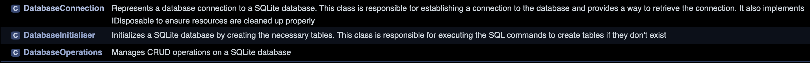

# Documentation

This section is related to your work on clean code and documentation in week 5.

First, choose six rules of clean code and explain them. For each one,

* Summarise the rule in your own words.
* Provide an example from the code that you wrote in week 2 and then refined in week 4.
* Explain how your code implements the rule. 

Second, copy the doxygen comments from your code into your portfolio and provide some 
descriptive commentary on their purpose and structure. Use screenshots showing the HTML 
content that is generated from your code to illustrate your <h3> Explanation </h3>.

Finally, highlight three examples from your code where you have eliminated the need
for comments by adhering to the principles of clean code.

 
<h1> Six Rules Of Clean Code </h1>
<h3> This weeks portfolio assignment was to an exemplification of clean code in practice, this is available below. </h3>

<h2> 1. Meaningful Names </h2>
<h3> Summary </h3>
Select descriptive and unambiguous names for variables, methods, and classes to clearly communicate their purpose or function.

<h3> Example </h3>
<h4> Before </h4> (Week 2)

```csharp

public class DatabaseInitialiser { }

```

<h4> After </h4> (Week 4)

```csharp

public class SqliteDbTableInitializer { }

```
<h3> Explanation </h3>
The refined name SqliteDbTableInitializer indicates that the class is related to initializing tables in an SQLite database, providing more explicit information than DatabaseInitialiser.


<h2> 2. Small Functions </h2>
<h3> Summary </h3>
Construct functions to be succinct and focused on a single responsibility to enhance readability.

<h3> Example </h3>
<h4> Before </h4>

```csharp

public void InitialiseTables() { /*... logic of opening connection, creating tables, and closing connection ...*/ }
```
<h4> After </h4>


```csharp

public void InitialiseTables() {
    OpenConnection();
    ExecuteTableCreationCommands();
    CloseConnection();
}

```
<h3> Explanation </h3>
In the refined version, InitialiseTables() has been simplified into smaller functions, each performing a single operation, adhering to the principle of small functions.

<h2> 3. Avoid Output Arguments </h2>
<h3> Summary </h3>
Return results from functions instead of using output parameters to simplify function usage and avoid unexpected side effects.

<h3> Example </h3>
<h4> Before </h4>

```csharp

public void GetRecordId(string tableName, string name, out int id) { /*... logic ...*/ }
```

<h4> After </h4>

```csharp

public int GetRecordId(string tableName, string name) { /*... logic ...*/ }
```
<h3> Explanation </h3>
GetRecordId now returns the ID directly, eliminating the need for an output parameter and enhancing clarity.

<h2> 4. Error Handling is One Thing </h2>
<h3> Summary </h3>
Separate error handling and primary logic within functions to improve readability and maintainability.

<h3> Example </h3>
<h4> Before </h4>

```csharp

public void AddRecord(string tableName, string name) { /*... logic and error handling...*/ }
```
<h4> After </h4>

```csharp

public void AddRecord(string tableName, string name) {
    try {
        // primary logic
    } catch (Exception e) {
        // error handling
    }
}
```
<h3> Explanation </h3>
Error handling and main logic are distinctly separated in the refined function, adhering to the principle that a function should address error handling as a singular concern.

<h2> 5. Don't Repeat Yourself (DRY) </h2>
<h3> Summary </h3>
Avoid code duplication to ensure easier maintenance and consistency in logic application.

<h3> Example </h3>
<h4> Before </h4>

```csharp

public void AddContinent(string name) { /*... logic ...*/ }
public void AddCountry(string name) { /*... similar logic ...*/ }
```
<h4> After </h4>

```csharp
public void AddRecordToTable(string tableName, string name) { /*... logic ...*/ }

```

<h3> Explanation </h3>
The method AddRecordToTable provides a generalized solution, preventing repetitive logic and ensuring a single point of modification.

<h2> 6. Comments Only When Necessary </h2>
<h3> Summary </h3>
Use comments judiciously for explaining the rationale or intricacies behind a code segment, not to describe what it does.

<h3> Example </h3>
<h4> Before </h4>

```csharp

// Adding record
public void AddRecord(string tableName, string name) { /*... logic ...*/ }
```
<h4> After </h4>

```csharp

public void AddRecord(string tableName, string name) { /*... logic ...*/ }
```
<h3> Explanation </h3>
The refined version removes the unnecessary comment since the method name AddRecord is already descriptive, adhering to the principle that code should be self-documenting when possible.

The applied refinements from Week 2 to Week 4 illustrate adherence to clean coding principles, enhancing the readability, maintainability, and overall quality of the code.

<h1> Doxygen Implementation </h1>
<h2> Providing an automated platform for multi-language code documentation using HTML as an interface </h2>

<h2> Doxygen Comments </h2>
Better comments provide for better Doxygen analysis and as such we have used a Doxygen recognised comment standard '///'. This can be translated into an HTML-based documentation. <param> provides information about the parameters, and <exception> describes possible exceptions thrown by the method.

```csharp
/// <summary>
/// Initializes a new instance of the <see cref="DatabaseInitialiser"/> class.
/// </summary>
/// <param name="connection">The SQLite connection to use for database initialization.</param>
/// <exception cref="ArgumentNullException">Thrown if the provided connection is null.</exception>
public DatabaseInitialiser(SqliteConnection connection)
```

This format is standardized, aiding developers in understanding the functionality and usage of the method at a glance without delving deep into the implementation details. It also supports the generation of external documentation, making API documentation, for instance, consistent and comprehensible.

<h2> Final results from Doxygen assisted documentation generation </h2>



<h2> The Role Of Clean Code In Reducing Commentary </h2>

<h3> Example 1: Self-Documenting Function Name </h3>

<h4> Initial Code: </h4>

```csharp
public class DatabaseInitialiser
```
<h4> Refactored Code: </h4>

```csharp
public class SqliteDatabaseTableInitialiser
```
<h4> Explanation: </h4>
The refactored name SqliteDatabaseTableInitialiser clearly conveys its purpose of initializing tables in an SQLite database, reducing the necessity for additional comments.

<h3> Example 2: Extract Method Refactor for Clarity </h3>
<h4>Initial Code: </h4>

```csharp
public void InitialiseTables()
{
    // Logic to execute table creation commands
}
```
<h4> Refactored Code: </h4>

```csharp
public void InitialiseTables()
{
    ExecuteTableCreationCommands();
}

private void ExecuteTableCreationCommands()
{
    // Logic to execute table creation commands
}
```
<h4>Explanation: </h4>
Extracting the logic for executing table creation commands into its own method (ExecuteTableCreationCommands) simplifies InitialiseTables and removes the need for inline comments.

<h3> Example 3: Encapsulating Conditional Logic </h3>

<h4> Initial Code: </h4>

```csharp
public void InitialiseTables()
{
    // Logic for checking and opening a database connection
}
```

<h4> Refactored Code: </h4>

```csharp
public void InitialiseTables()
{
    EnsureDatabaseConnectionIsOpen();
}

private void EnsureDatabaseConnectionIsOpen()
{
    // Logic for checking and opening a database connection
}
```
<h4> Explanation: </h4>
Encapsulating the logic for ensuring the database connection is open into a method (EnsureDatabaseConnectionIsOpen) enhances readability and reduces the need for explanatory comments.

These refinements make the code more self-explanatory, adhering to clean code principles by making the code itself serve as documentation wherever possible.


